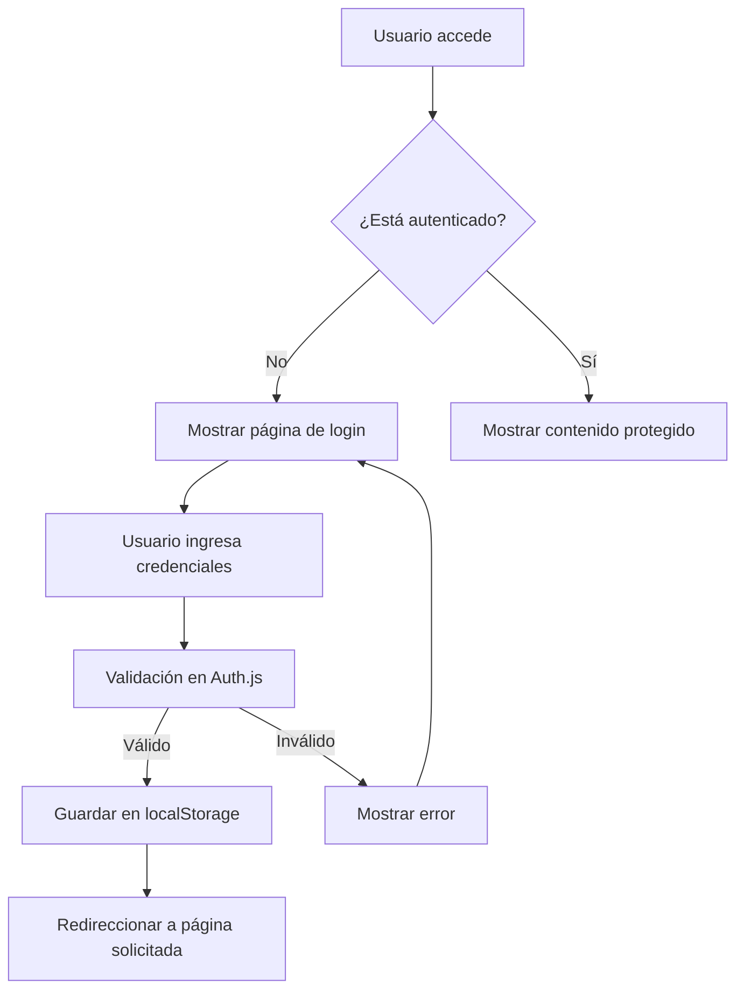
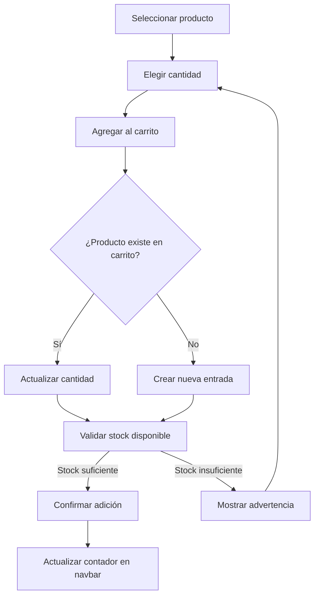

# Nuvastore - Plataforma de E-commerce Tecnológico

## 📋 Descripción del Proyecto

**Nuvastore** es una aplicación web de comercio electrónico especializada en productos tecnológicos, desarrollada con Vue.js 3 y diseñada para ofrecer una experiencia de usuario moderna y fluida. La plataforma implementa un sistema completo de gestión de productos, autenticación de usuarios y carrito de compras, con una arquitectura modular y escalable.

### Propósito y Alcance

El proyecto tiene como objetivo principal demostrar la implementación de una Single Page Application (SPA) completa que incluye:

- **Sistema de autenticación** con registro e inicio de sesión
- **Catálogo de productos** con funcionalidades de búsqueda y filtrado
- **Carrito de compras** con gestión de cantidades y persistencia
- **Navegación protegida** con guards de autenticación
- **Interfaz responsive** optimizada para dispositivos móviles y desktop
- **Gestión de estado** reactiva sin dependencias externas complejas

## 🏗️ Arquitectura y Tecnologías

### Stack Tecnológico

| Tecnología | Versión | Propósito |
|------------|---------|-----------|
| **Vue.js** | 3.5.18 | Framework principal para la interfaz de usuario |
| **Vue Router** | 4.5.1 | Enrutamiento y navegación SPA |
| **Vite** | 7.0.6 | Herramienta de build y desarrollo |
| **Bootstrap** | 5.3.8 | Framework CSS para diseño responsive |
| **Font Awesome** | 6.7.2 | Biblioteca de iconos |
| **Axios** | 1.12.2 | Cliente HTTP para comunicación con APIs |
| **jQuery** | 3.7.1 | Manipulación DOM y compatibilidad Bootstrap |

### Estructura del Proyecto

```
nuvenda-app/
├── src/
│   ├── components/          # Componentes reutilizables
│   │   ├── Navbar.vue      # Barra de navegación principal
│   │   ├── Products.vue    # Catálogo de productos
│   │   └── CartDetail.vue  # Modal del carrito de compras
│   ├── views/              # Vistas principales
│   │   ├── Home.vue        # Página de inicio
│   │   └── Login.vue       # Página de autenticación
│   ├── services/           # Lógica de negocio
│   │   ├── auth.js         # Servicio de autenticación
│   │   └── api.js          # Servicio de datos de productos
│   ├── router/             # Configuración de rutas
│   │   └── index.js        # Definición de rutas y guards
│   ├── assets/             # Recursos estáticos
│   │   ├── base.css        # Variables CSS y estilos base
│   │   ├── main.css        # Estilos globales
│   │   └── custom-bootstrap.css # Personalización de Bootstrap
│   └── main.js             # Punto de entrada de la aplicación
├── public/                 # Archivos públicos
├── package.json           # Dependencias y scripts
└── vite.config.js         # Configuración de Vite
```

## 🔧 Funcionalidades Principales

### 1. Sistema de Autenticación

#### Flujo de Trabajo


#### Características Técnicas
- **Persistencia**: Utiliza `localStorage` para mantener la sesión del usuario
- **Validación**: Verificación de credenciales contra base de datos simulada
- **Registro**: Permite crear nuevas cuentas con validación de email único
- **Guards de navegación**: Protección automática de rutas que requieren autenticación
- **Sincronización**: Detección de cambios de sesión entre pestañas del navegador

#### Credenciales de Prueba
```javascript
Email: usuario1@mitienda.com
Contraseña: password
```

### 2. Gestión de Productos

#### Catálogo de Productos
La aplicación incluye un catálogo de 10 productos tecnológicos con las siguientes características:

| Producto | Precio | Stock | Categoría |
|----------|--------|-------|-----------|
| Samsung Galaxy S24 | $899.99 | 15 | Smartphones |
| Dell XPS 13 | $1,299.99 | 8 | Laptops |
| Sony WH-1000XM5 | $399.99 | 25 | Audio |
| iPad Air | $599.99 | 12 | Tablets |
| Apple Watch Series 9 | $429.99 | 20 | Wearables |
| Canon EOS R6 | $2,499.99 | 5 | Cámaras |
| Logitech MX | $149.99 | 30 | Accesorios |
| LG UltraWide 34" | $799.99 | 7 | Monitores |
| PlayStation 5 | $499.99 | 3 | Gaming |
| JBL Charge 5 | $179.99 | 18 | Audio |

#### Funcionalidades de Búsqueda y Filtrado
- **Búsqueda en tiempo real**: Filtrado instantáneo por nombre de producto
- **Filtros por categoría**: Organización por tipo de producto
- **Indicadores de stock**: Visualización clara del inventario disponible
- **Gestión de cantidades**: Selección de cantidad antes de agregar al carrito

### 3. Carrito de Compras

#### Flujo de Gestión del Carrito


#### Características del Carrito
- **Persistencia**: Mantenimiento del carrito entre sesiones
- **Validación de stock**: Verificación automática de disponibilidad
- **Gestión de cantidades**: Incremento/decremento desde el modal
- **Cálculo automático**: Subtotales y total general en tiempo real
- **Eliminación selectiva**: Remoción individual de productos
- **Vaciado completo**: Opción de limpiar todo el carrito

### 4. Navegación y Enrutamiento

#### Rutas Implementadas
| Ruta | Componente | Protección | Descripción |
|------|------------|------------|-------------|
| `/` | Home.vue | Pública | Página principal con productos públicos |
| `/login` | Login.vue | Solo invitados | Formulario de autenticación |
| `/products` | Home.vue | Requiere auth | Catálogo completo de productos |

#### Guards de Navegación
- **requiresAuth**: Redirecciona a login si no está autenticado
- **requiresGuest**: Redirecciona a home si ya está autenticado
- **Redirección inteligente**: Guarda la URL solicitada para redireccionar después del login

### 5. Interfaz de Usuario

#### Diseño Responsive
- **Mobile-first**: Diseño optimizado para dispositivos móviles
- **Breakpoints Bootstrap**: Adaptación automática a diferentes tamaños de pantalla
- **Navegación colapsible**: Menú hamburguesa en dispositivos móviles
- **Cards adaptativas**: Productos organizados en grid responsive

#### Componentes de UI
- **Navbar**: Barra de navegación con indicador de carrito y menú de usuario
- **Product Cards**: Tarjetas de producto con imagen, información y controles
- **Modal de Carrito**: Overlay para gestión del carrito de compras
- **Notificaciones**: Sistema de alertas para feedback del usuario
- **Formularios**: Interfaces de login y registro con validación

## 🚀 Configuración y Ejecución

### Requisitos Previos
- **Node.js**: Versión 20.19.0 o superior (recomendado 22.12.0+)
- **npm**: Incluido con Node.js
- **Navegador moderno**: Chrome, Firefox, Safari, Edge

### Instalación

1. **Clonar el repositorio**
```bash
git clone [URL_DEL_REPOSITORIO]
cd nuvenda-app
```

2. **Instalar dependencias**
```bash
npm install
```

3. **Ejecutar en modo desarrollo**
```bash
npm run dev
```

4. **Acceder a la aplicación**
```
http://localhost:5173/
```

### Scripts Disponibles

| Script | Comando | Descripción |
|--------|---------|-------------|
| **Desarrollo** | `npm run dev` | Inicia servidor de desarrollo con hot reload |
| **Construcción** | `npm run build` | Genera build optimizado para producción |
| **Vista previa** | `npm run preview` | Sirve el build de producción localmente |

### Variables de Entorno
El proyecto no requiere variables de entorno adicionales para funcionar en modo desarrollo.

## 📊 Cumplimiento de Requisitos

### Requisitos Funcionales Implementados

✅ **Autenticación de usuarios**
- Sistema completo de login/registro
- Persistencia de sesión
- Validación de credenciales
- Protección de rutas

✅ **Gestión de productos**
- Catálogo completo con 10 productos
- Búsqueda y filtrado en tiempo real
- Información detallada de cada producto
- Gestión de inventario

✅ **Carrito de compras**
- Adición/eliminación de productos
- Gestión de cantidades
- Cálculo de totales
- Persistencia entre sesiones

✅ **Interfaz responsive**
- Diseño mobile-first
- Adaptación a diferentes dispositivos
- Navegación intuitiva
- Feedback visual apropiado

### Requisitos Técnicos Implementados

✅ **Vue.js 3 con Composition API**
- Uso de `<script setup>` en componentes modernos
- Reactividad con `ref` y `computed`
- Lifecycle hooks (`mounted`, `beforeUnmount`)

✅ **Vue Router 4**
- Navegación SPA
- Guards de autenticación
- Rutas protegidas
- Redirección inteligente

✅ **Gestión de estado**
- Provide/Inject para estado global
- LocalStorage para persistencia
- Reactividad sin Vuex/Pinia

✅ **Arquitectura modular**
- Separación de responsabilidades
- Servicios independientes
- Componentes reutilizables

## 🔍 Consideraciones Técnicas

### Mejores Prácticas Implementadas

#### 1. Arquitectura de Componentes
- **Separación de responsabilidades**: Cada componente tiene una función específica
- **Reutilización**: Componentes diseñados para ser reutilizables
- **Props e Inject**: Comunicación eficiente entre componentes
- **Eventos personalizados**: Comunicación ascendente limpia

#### 2. Gestión de Estado
- **Estado local**: Uso de `data()` para estado específico del componente
- **Estado global**: Provide/Inject para carrito y notificaciones
- **Persistencia**: LocalStorage para datos que deben sobrevivir recargas
- **Reactividad**: Aprovechamiento del sistema reactivo de Vue

#### 3. Rendimiento
- **Lazy loading**: Carga diferida de componentes no críticos
- **Computed properties**: Cálculos optimizados y cacheados
- **Event listeners**: Limpieza apropiada en `beforeUnmount`
- **Imágenes optimizadas**: Uso de placeholders para desarrollo

#### 4. Seguridad
- **Validación de entrada**: Verificación de datos en formularios
- **Sanitización**: Prevención de XSS en contenido dinámico
- **Autenticación**: Verificación de permisos en cada navegación
- **Almacenamiento seguro**: Uso apropiado de localStorage

### Patrones de Diseño Utilizados

#### 1. Service Layer Pattern
```javascript
// Separación de lógica de negocio en servicios
export class Auth {
  static async login(credentials) { /* ... */ }
  static getCurrentUser() { /* ... */ }
}
```

#### 2. Observer Pattern
```javascript
// Reactividad de Vue para observar cambios
watch: {
  searchTerm() {
    this.filterProducts()
  }
}
```

#### 3. Provider Pattern
```javascript
// Inyección de dependencias para estado global
app.provide('cartItems', cartItems)
app.provide('showNotification', showNotification)
```

### Optimizaciones Implementadas

#### 1. Bundle Optimization
- **Tree shaking**: Eliminación de código no utilizado
- **Code splitting**: División automática del código
- **Asset optimization**: Optimización de recursos estáticos

#### 2. Performance
- **Debouncing**: En búsqueda de productos para evitar llamadas excesivas
- **Memoization**: Caching de cálculos costosos
- **Lazy loading**: Carga diferida de componentes

#### 3. User Experience
- **Loading states**: Indicadores de carga durante operaciones
- **Error handling**: Manejo graceful de errores
- **Feedback inmediato**: Notificaciones instantáneas de acciones

## 🔮 Posibles Mejoras Futuras

### Funcionalidades Adicionales
- **Wishlist**: Lista de productos favoritos
- **Comparación**: Comparar productos lado a lado
- **Reviews**: Sistema de reseñas y calificaciones
- **Checkout**: Proceso completo de compra
- **Historial**: Registro de compras anteriores

### Mejoras Técnicas
- **API real**: Integración con backend real
- **Testing**: Implementación de tests unitarios y e2e
- **PWA**: Conversión a Progressive Web App
- **Internacionalización**: Soporte multi-idioma
- **Analytics**: Integración con herramientas de análisis

### Optimizaciones
- **CDN**: Distribución de contenido estático
- **Caching**: Estrategias avanzadas de cache
- **SEO**: Optimización para motores de búsqueda
- **Accessibility**: Mejoras de accesibilidad web

---

## 📞 Soporte y Contacto

Para consultas técnicas o reportes de bugs, por favor contactar al equipo de desarrollo.

**Versión**: 1.0.0  
**Última actualización**: Diciembre 2024  
**Compatibilidad**: Navegadores modernos (Chrome 90+, Firefox 88+, Safari 14+, Edge 90+)
